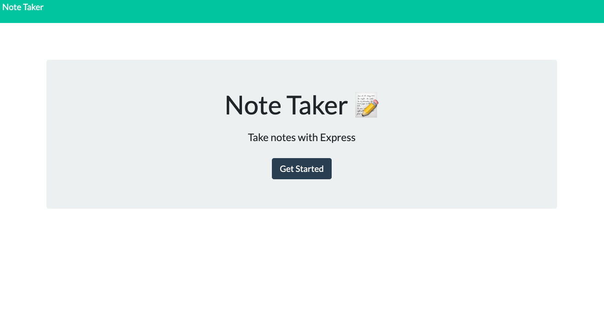
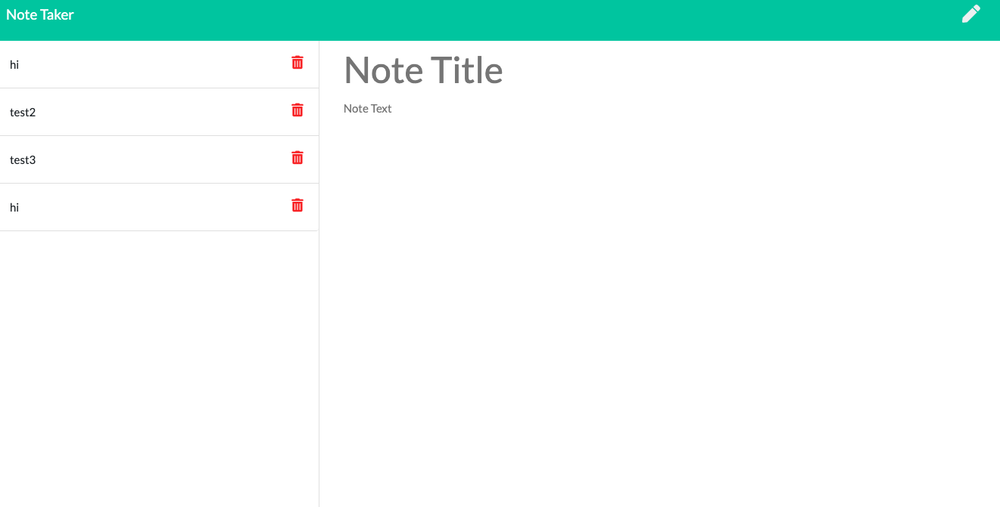

# Note Taker

## Table of Contents
* [Description](#description)
* [Usage](#usage)
* [Links](#links)
* [Screenshots](#screenshots)
* [Questions](#questions)

## Description
An application that writes, saves, and deletes notes. The note taker application uses backend express, and  API and HTML routes to create a user friendly note taker for everyday notes.

## Usage
This application can be used for everyday note taking to keep track of your busy days, so you don't miss a beat. 

## Links
Github Repo: https://github.com/nataliegarcia-8/note-taker

Heroku Link: https://note-taker-ngarcia.herokuapp.com/notes

## Screenshots
home screen:

notes screen:

## Questions 
### If you have any questions please contact me at:
Email: gnatalie.booking@gmail.com

Github: https://github.com/natalie-garcia-8